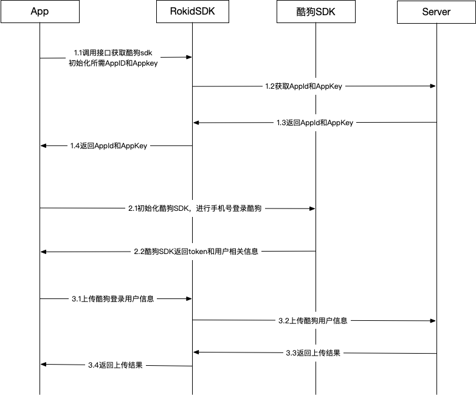

## 酷狗音乐 Skill 授权

### 概述

本文档适用于第三方厂商使用酷狗音乐技能。用户登录酷狗音乐账号并获取token，使用酷狗音乐账号token将酷狗音乐账号与Rokid账号进行绑定。

### 酷狗音乐SDK及文档

文档地址：<https://github.com/Rokid/RokidMobileSDKiOSDemo/tree/master/Third/KuGou>

###  酷狗音乐接入流程

### RokidSDK接口调用

* 获取酷狗音乐SDK初始化所需的AppId和AppKey

入参：

| 字段         | 类型             | 是否必需 | 说明                              |
| :----------- | ---------------- | -------- | :-------------------------------- |
| type         | SDKThirdAuthType | 是       | 枚举类型，传入枚举对应的KUGOU类型 |
| deviceTypeId | String           | 是       | 设备类型Id                        |

OC示例：

~~~objective-c
///获取酷狗AppId和key
[RokidMobileSDK.media
             getThirdOauthInfoWithType:SDKThirdAuthTypeKUGOU
             deviceTypeId:@"563E160D05EA42DA9E0A8C***"
             completion:^(RKError * error, SDKThirdAuthInfo * info) {
                if (error) {
                    NSLog(@"error is %@",error.message);
                }else {
                    SDKThirdAuthInfo *data = info;
                    NSString *appId = data.baseAppId;
                    NSString *appScrect = data.baseAppSecret;
                    NSLog(@"---------success!");
                }
  }];
~~~

* 上传酷狗登录成功后的用户相关信息

入参：

| 字段         | 类型   | 是否必须 | 说明                   |
| ------------ | ------ | -------- | ---------------------- |
| deviceId     | String | 是       | 设备SN号               |
| deviceTypeId | String | 是       | 设备类型Id             |
| tokenInfo    | String | 是       | 酷狗登录成功的用户信息 |

  【备注】

  酷狗登录接口返回

  ~~~
  {"status":1,
  "error_code":0,
  "data":{"nickname":"1409720***","token":"f0a5650469c31c3cc8abd1***","sex":2,"username":"1345***","pic":"http:\/\/imge.kugou.com\/kugouicon\/165\/20100101\/20100101192931478054.jpg","userid":"1409***"}
  }
  ~~~

  上面入参里的tokenInfo是取"data"字段对应的Json处理成json String

​      OC示例：

~~~objective-c
///上传tokenInfo
NSString *deviceId = @"020102170200****";
NSString *deviceTypeId = @"563E160D05EA42DA9E0A8C1EED7****";
NSString *jsonInfo =  @"{\"pic\":\"http:\\\/\\\/imge.kugou.com\\\/kugouicon\\\/165\\\/20100101\\\/20100101192931478054.jpg\",\"username\":\"1515889****\",\"token\":\"2569ad804bc4a9c34b5e2d2ec22bbecef454e405070f16f014e02f47f39e890f625068daf801fe088cd02aa5****\",\"userid\":\"14167****\",\"sex\":2,\"nickname\":\"1416789***\"}";
[RokidMobileSDK.media uploadKuGouTokenInfoWithDeviceTypeId:deviceTypeId deviceId:deviceId tokenInfo:jsonInfo completion:^(RKError * error) {
    if(error) {
		NSLog(@"error is %@",error.message);
    }else {
        NSLog(@"upload success!");
    }
 }];
~~~

* 解绑酷狗音乐

入参：

| 字段         | 类型             | 是否必须 | 说明                              |
| ------------ | ---------------- | -------- | --------------------------------- |
| type         | SDKThirdAuthType | 是       | 枚举类型，传入枚举对应的KUGOU类型 |
| deviceTypeId | String           | 是       | 设备类型Id                        |

​	OC示例：

~~~objective-c
///解绑酷狗音乐
NSString *deviceTypeId = @"563E160D05EA42DA9E0A8C1EED76****";
[RokidMobileSDK.media unbindThirdAuthWithType:SDKThirdAuthTypeKUGOU deviceTypeId:deviceTypeId completion:^(RKError * error) {
    if(error) {
		NSLog(@"error is %@",error.message);
    }else {
        NSLog(@"unbind success!");
    }
 }];
~~~

